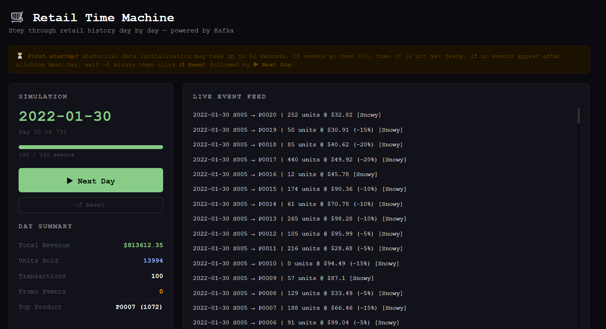

# Real-Time Retail API with Optuna Forecasting
**Data Engineering portfolio project demonstrating event-driven architecture, real-time streaming, and ML-powered demand forecasting.**

A Kafka-backed retail analytics pipeline with a day-by-day time simulation. Step through 731 days of retail history clicking "Next Day" in a browser where each click triggers a Kafka event burst, streams transactions live through the pipeline, and updates real-time analytics. Includes Bayesian hyperparameter optimization via Optuna for per-product demand forecasting, with trial results persisted to MySQL for historical analysis.

Dataset sourced from Kaggle — ["Retail Store Inventory Forecasting Dataset"](https://www.kaggle.com/datasets/anirudhchauhan/retail-store-inventory-forecasting-dataset) by anirudhchauhan.
Dataset description from Kaggle:
This dataset provides synthetic yet realistic data for analyzing and forecasting retail store inventory demand. It contains over 73000 rows of daily data across multiple stores and products, including attributes like sales, inventory levels, pricing, weather, promotions, and holidays.

The dataset is ideal for practicing machine learning tasks such as demand forecasting, dynamic pricing, and inventory optimization. It allows data scientists to explore time series forecasting techniques, study the impact of external factors like weather and holidays on sales, and build advanced models to optimize supply chain performance.

## Architecture
```text
CSV (Kaggle) ──> ETL (Python) ──> MySQL Database
                                        │
                              Kafka Producer ──> Kafka (KRaft)
                                                      │
                                              Kafka Consumer
                                                      │
                                              FastAPI (SSE) ──> Browser UI
                                                      │
                                              Optuna Optimizer
```

Each "Next Day" click:
1. FastAPI advances `SimulationState` (in-memory, thread-safe)
2. Producer detects new day via polling → fetches rows from MySQL → publishes to Kafka
3. Consumer reads Kafka → writes to `kafka_events` MySQL table
4. SSE endpoint tails `kafka_events` by `id` → pushes events to browser in real time

## Tech Stack

- **Language:** Python 3.11
- **API:** FastAPI + Uvicorn
- **Real-time browser:** Server-Sent Events (SSE), browser-native with no WebSockets needed
- **Database:** MySQL 8.0, raw `mysql-connector-python`
- **Streaming:** Kafka 7.6.0 (Confluent) KRaft mode
- **Optimization:** Optuna 3.6.1 (TPE sampler, hyperparameter search)
- **Containers:** Docker + Docker Compose (6 services)
- **Data:** pandas, numpy

## Prerequisites

- Docker Desktop
- Docker Compose

## Installation
```bash
# Clone repository
git clone https://github.com/Yotane/real-time-retail-api.git
cd real-time-retail-api

# Configure environment
cp .env.example .env
# Edit .env with your preferred credentials
```

Download the dataset from [Kaggle](https://www.kaggle.com/datasets/anirudhchauhan/retail-store-inventory-forecasting-dataset) and place it at:
```
data/raw/retail_store_inventory.csv
```

## Running the Project
```bash
# First run — builds images, loads data, starts all services
docker compose up --build

# Subsequent runs (data already loaded)
docker compose up

# Full clean reset (wipes database volume)
docker compose down -v
docker compose up --build
```

Once running, open the browser UI:
```
http://localhost:8000/stream/live
```

Click **▶ Next Day** to begin streaming. Each click sends that day's transactions through Kafka in real time.

API docs (Swagger UI):
```
http://localhost:8000/docs
```

## Testing

Integration tests run against live containers using `httpx`. Docker Compose must be running before executing tests.
```bash
# Run all tests
pytest tests/test_api.py -v

# Run a specific class
pytest tests/test_api.py::TestOptimizeDemand -v
```

28 tests across 6 classes:

| Class | Coverage |
|-------|----------|
| `TestHealth` | `/health` endpoint |
| `TestSimulationStatus` | Status fields, types, progress range |
| `TestSimulationReset` | Reset clears state correctly |
| `TestSimulationNextDay` | Day advancement, date format, index increment |
| `TestSalesRecent` | Event shape, limit param, default limit |
| `TestOptimizeHistory` | Trial shape, filters, RMSE validity |
| `TestOptimizeDemand` | Forecast shape, trial count, trend values, validation errors |

Note: `TestSimulationNextDay` tests auto-skip if the producer hasn't registered dates yet (`total_days == 0`). Run `docker compose up` and wait for the producer to start before running the full suite.

## Project Structure
```
real-time-retail-api/
├── app/
│   ├── main.py           # FastAPI endpoints, SSE stream, simulation control
│   ├── simulation.py     # SimulationState dataclass with threading lock
│   └── optimizer.py      # Optuna demand forecasting optimizer
├── etl/
│   ├── schema.sql        # MySQL schema (5 tables + indexes)
│   └── load.py           # CSV → MySQL ETL with retry logic
├── kafka/
│   ├── producer/
│   │   └── producer.py   # Polls API for current day, sends rows to Kafka
│   └── consumer/
│       └── consumer.py   # Reads Kafka, writes to MySQL
├── data/raw/             # Place dataset CSV here (gitignored)
├── docker-compose.yml    # All 6 services
├── Dockerfile.api
├── Dockerfile.etl
├── Dockerfile.producer
├── Dockerfile.consumer
├── requirements.txt
└── .env.example
```

## Docker Services

| Service | Description | Port |
|---------|-------------|------|
| `mysql` | MySQL 8.0, persistent named volume | 3307 |
| `etl` | One-shot CSV loader, exits after completion | — |
| `kafka` | Confluent Kafka 7.6.0 KRaft mode | 9092 |
| `producer` | Polls simulation API, publishes daily events | — |
| `consumer` | Reads Kafka, writes to `kafka_events` | — |
| `api` | FastAPI, simulation control, SSE, analytics | 8000 |

Startup order: `mysql (healthy)` → `etl (completed)` → `kafka (healthy)` → `producer + consumer + api`

## Database Schema
```
stores        → store_id (PK), region
products      → product_id (PK), category
calendar      → date (PK), weather_condition, is_holiday_promo, seasonality
sales_facts   → id, date, store_id, product_id, inventory_level, units_sold,
                units_ordered, demand_forecast, price, discount, competitor_pricing
                UNIQUE (date, store_id, product_id)
kafka_events  → id, event_id (UNIQUE), store_id, product_id, date,
                units_sold, price, discount, is_holiday_promo, weather, received_at
optuna_trials → id, study_name, trial_number, store_id, product_id,
                _window, min_periods, trend_window, rmse, completed_at
```

## API Endpoints

### Simulation

| Method | Endpoint | Description |
|--------|----------|-------------|
| `GET` | `/stream/live` | Browser UI, day-by-day simulation |
| `GET` | `/stream/events` | SSE endpoint pushing live Kafka events |
| `POST` | `/simulation/next-day` | Advance simulation by one day |
| `POST` | `/simulation/reset` | Reset to day 0 |
| `GET` | `/simulation/status` | Current day, progress, totals |
| `POST` | `/simulation/init` | Register dates (called by producer on startup) |

### Analytics

| Method | Endpoint | Description |
|--------|----------|-------------|
| `GET` | `/sales/recent` | Last N events from kafka_events |
| `GET` | `/demand/predict` | Moving average demand forecast scoped to simulation day |
| `GET` | `/price/sensitivity` | Price elasticity analysis scoped to simulation day |
| `GET` | `/promotions/simulate` | Promotion effect simulation scoped to simulation day |

### Optuna Optimization

| Method | Endpoint | Description |
|--------|----------|-------------|
| `POST` | `/optimize/demand` | Run Optuna, find best forecast params, return optimized forecast scoped to simulation day |
| `GET` | `/optimize/history` | Query past optimization runs from MySQL |

## Demand Forecasting with Optuna

`POST /optimize/demand?store_id=S001&product_id=P0001&n_trials=20`

Runs Bayesian hyperparameter search (TPE sampler) over:
- `window` — moving average lookback window (3-30 days)
- `min_periods` — minimum data points required (1-7)
- `trend_window` — trend detection window (5-21 days)

Evaluates each combination on a held-out test set (last 20% of history) using RMSE. Returns the best parameters and immediately applies them to produce a 7-day forward forecast.

All analytics and optimization endpoints accept an optional `day` parameter (1-731) to scope the analysis up to a specific simulation day. When not provided, the endpoints default to the current simulation day reflected in the stream live UI. This means the analytics stay in sync with wherever you are in the simulation. If you are on day 30, all endpoints automatically analyze only the first 30 days of data.

## Example API Responses

### Live Stream UI


All responses below were captured at day 30 of the simulation. Since no `day` parameter was passed, the endpoints automatically used day 30 as the cutoff -- the default value pulled from the current simulation state.


### Recent Kafka Events
`GET /sales/recent?limit=5`

Live transactions written by the Kafka consumer as they arrive. Each record represents a sale event that traveled through the full pipeline: producer fetched it from MySQL, published it to the Kafka topic, consumer received it and persisted it, then the SSE endpoint picked it up and pushed it to the browser in real time.
```json
{
  "events": [
    {
      "store_id": "S005",
      "product_id": "P0011",
      "date": "2022-01-30",
      "units_sold": 216,
      "price": 28.68,
      "discount": 5,
      "is_holiday_promo": 0,
      "weather": "Snowy",
      "received_at": "2026-02-26T11:42:37"
    },
    {
      "store_id": "S005",
      "product_id": "P0008",
      "date": "2022-01-30",
      "units_sold": 129,
      "price": 33.49,
      "discount": 5,
      "is_holiday_promo": 0,
      "weather": "Snowy",
      "received_at": "2026-02-26T11:42:37"
    },
    {
      "store_id": "S005",
      "product_id": "P0017",
      "date": "2022-01-30",
      "units_sold": 440,
      "price": 49.92,
      "discount": 20,
      "is_holiday_promo": 0,
      "weather": "Snowy",
      "received_at": "2026-02-26T11:42:37"
    }
  ]
}
```

### Optimized Demand Forecast
`POST /optimize/demand?store_id=S001&product_id=P0001&n_trials=20`
```json
{
  "store_id": "S001",
  "product_id": "P0001",
  "analysis_up_to_day": "2022-01-30",
  "forecast": {
    "method": "moving_average_optimized",
    "window_used": 6,
    "min_periods_used": 3,
    "history_days_used": 30,
    "forecast_next_day": 112.67,
    "trend": "down",
    "trend_pct": -40,
    "7_day_forward": [
      {"day": 1, "forecast_units": 112.67},
      {"day": 2, "forecast_units": 112.67},
      {"day": 3, "forecast_units": 112.67},
      {"day": 4, "forecast_units": 112.67},
      {"day": 5, "forecast_units": 112.67},
      {"day": 6, "forecast_units": 112.67},
      {"day": 7, "forecast_units": 112.67}
    ],
    "last_5_actuals": [
      {"date": "2022-01-26", "units_sold": 49},
      {"date": "2022-01-27", "units_sold": 164},
      {"date": "2022-01-28", "units_sold": 97},
      {"date": "2022-01-29", "units_sold": 47},
      {"date": "2022-01-30", "units_sold": 130}
    ]
  },
  "optimization": {
    "n_trials": 20,
    "study_name": "S001_P0001",
    "first_trial_rmse": 60.1403,
    "best_rmse": 52.8561,
    "improvement_pct": 12.1,
    "best_params": {"window": 6, "min_periods": 3, "trend_window": 11},
    "top_5_trials": [
      {"trial": 8,  "window": 6,  "rmse": 52.8561},
      {"trial": 5,  "window": 26, "rmse": 54.8448},
      {"trial": 20, "window": 26, "rmse": 54.8448},
      {"trial": 3,  "window": 4,  "rmse": 54.8793},
      {"trial": 11, "window": 3,  "rmse": 54.8793}
    ]
  }
}
```

Optuna tested 20 parameter combinations and found that a 6-day lookback window produces the most accurate forecast for S001/P0001, achieving a 12.1% improvement in error rate over the starting parameters. Based on the first 30 days of sales history, the model predicts an average of 112.67 units per day for the next 7 days. The overall trend is down at -40%, meaning recent sales have been lower than the earlier days in this window. Stepping further through the simulation and calling this endpoint again will update the forecast to reflect the additional history.

### Price Sensitivity Analysis
`GET /price/sensitivity?product_id=P0001`
```json
{
  "product_id": "P0001",
  "analysis_up_to_day": "2022-01-30",
  "total_records": 150,
  "price_range": {"min": 10.38, "max": 99.7, "mean": 54.45},
  "avg_units_sold": 129.59,
  "elasticity": 55.6312,
  "correlation": 0.0545,
  "interpretation": "Positive elasticity — higher price correlates with higher sales (possible premium/luxury effect).",
  "price_brackets": [
    {"price_point": 10, "avg_units_sold": 79},
    {"price_point": 11, "avg_units_sold": 97},
    {"price_point": 12, "avg_units_sold": 102.5},
    {"price_point": 13, "avg_units_sold": 390},
    {"price_point": 15, "avg_units_sold": 375},
    {"price_point": 16, "avg_units_sold": 210},
    {"price_point": 17, "avg_units_sold": 90.5},
    {"price_point": 18, "avg_units_sold": 189},
    {"price_point": 19, "avg_units_sold": 368},
    {"price_point": 20, "avg_units_sold": 145}
  ]
}
```

Across 150 records from the first 30 days, P0001 shows positive elasticity with a near-zero correlation of 0.055. This means higher prices are loosely associated with higher sales in this early window, which is characteristic of a premium product where customers associate price with quality. The average units sold is 129.59 per day across all price points. As you step further through the simulation, the elasticity calculation gets more data and the pattern will either strengthen or normalize.

### Promotion Simulation
`GET /promotions/simulate?product_id=P0001&discount_pct=20`
```json
{
  "product_id": "P0001",
  "analysis_up_to_day": "2022-01-30",
  "simulated_discount_pct": 20,
  "baseline_avg_units": 130.89,
  "promo_avg_units": 128.6,
  "historical_uplift_pct": -1.8,
  "projected_units": 139.31,
  "projected_uplift_pct": 6.4,
  "total_promo_days": 85,
  "total_non_promo_days": 65,
  "discount_effect_by_tier": [
    {"discount_pct": 0,  "avg_units_sold": 133.5},
    {"discount_pct": 5,  "avg_units_sold": 117.48},
    {"discount_pct": 10, "avg_units_sold": 133.88},
    {"discount_pct": 15, "avg_units_sold": 122.49},
    {"discount_pct": 20, "avg_units_sold": 139.31}
  ],
  "recommendation": "A 20.0% discount is projected to increase daily sales from 130.9 to 139.31 units (+6.4% uplift)."
}
```

Scoped to the first 30 days, the historical promo days actually averaged slightly fewer units (128.6) than non-promo days (130.89), giving a -1.8% historical uplift. However, looking at the discount tiers specifically, the 20% discount tier shows the highest average of 139.31 units per day, which is what drives the +6.4% projected uplift in the recommendation. The 5% and 15% tiers underperform the no-discount baseline, suggesting that for P0001, only deeper discounts meaningfully move the needle in this early period.

## Stopping and Restarting
```bash
# Stop (keeps database data intact)
docker compose down

# Restart (no rebuild needed, data persists)
docker compose up

# After restart: click Reset in browser, then Next Day
# (API loses in-memory simulation state on restart — DB data is preserved)
```

## Future Roadmap

- **CI/CD:** GitHub Actions pipeline for automated testing and image builds
- **Monitoring:** Prometheus + Grafana for Kafka lag, event throughput, API latency
- **Frontend:** Chart.js visualizations for revenue trends, top products, weather correlation
- **Multi-step forecast:** Rolling forward projection instead of static mean

## Technical Stack Summary

| Component | Technology |
|-----------|-----------|
| Language | Python 3.11 |
| API Framework | FastAPI + Uvicorn |
| Database | MySQL 8.0 |
| Message Broker | Confluent Kafka 7.6.0 (KRaft) |
| Optimization | Optuna 3.6.1 (TPE Bayesian search) |
| Containers | Docker + Docker Compose |
| Data Processing | pandas, numpy |
| Real-time Stream | Server-Sent Events (SSE) |
| DB Driver | mysql-connector-python (no ORM) |

## License
This project is for educational purposes. Dataset sourced from [Kaggle](https://www.kaggle.com/datasets/anirudhchauhan/retail-store-inventory-forecasting-dataset) under their terms of use.

## Author

Matt Raymond Ayento  
Nagoya University  
G30, 3rd year Automotive Engineering (Electrical, Electronics, Information Engineering)