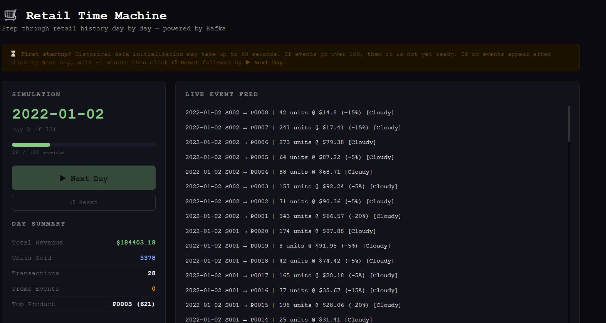
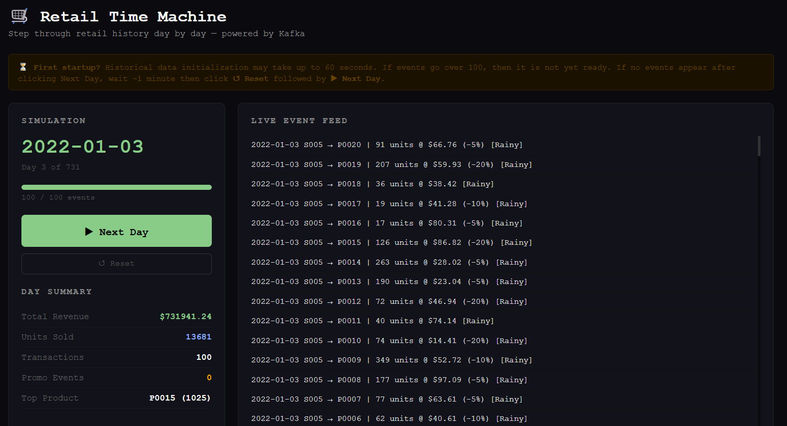

# Real-Time Retail API with Optuna Forecasting
**Data Engineering portfolio project demonstrating event-driven architecture, real-time streaming, and ML-powered demand forecasting.**

A Kafka-backed retail analytics pipeline with a day-by-day time simulation. Step through 731 days of retail history clicking "Next Day" in a browser where each click triggers a Kafka event burst, streams transactions live through the pipeline, and updates real-time analytics.

Dataset sourced from Kaggle — ["Retail Store Inventory Forecasting Dataset"](https://www.kaggle.com/datasets/anirudhchauhan/retail-store-inventory-forecasting-dataset) by anirudhchauhan. 73,100 rows covering 5 stores, 20 products, and 731 days (2022–2024).

## Architecture

```text
CSV (Kaggle) ──> ETL (Python) ──> MySQL Database
                                        │
                              Kafka Producer ──> Kafka (KRaft)
                                                      │
                                              Kafka Consumer
                                                      │
                                              FastAPI (SSE) ──> Browser UI
                                                      │
                                              Optuna Optimizer
```

Each "Next Day" click:
1. FastAPI advances `SimulationState` (in-memory, thread-safe)
2. Producer detects new day via polling → fetches rows from MySQL → publishes to Kafka
3. Consumer reads Kafka → writes to `kafka_events` MySQL table
4. SSE endpoint tails `kafka_events` by `id` → pushes events to browser in real time

## Tech Stack

- **Language:** Python 3.11
- **API:** FastAPI + Uvicorn
- **Real-time browser:** Server-Sent Events (SSE) — browser-native, no WebSockets
- **Database:** MySQL 8.0, raw `mysql-connector-python`
- **Streaming:** Kafka 7.6.0 (Confluent) KRaft mode
- **Optimization:** Optuna 3.6.1 (TPE sampler, hyperparameter search)
- **Containers:** Docker + Docker Compose (6 services)
- **Data:** pandas, numpy

## Prerequisites

- Docker Desktop
- Docker Compose


## Installation

```bash
# Clone repository
git clone https://github.com/Yotane/real-time-retail-api.git
cd real-time-retail-api

# Configure environment
cp .env.example .env
# Edit .env with your preferred credentials
```

Download the dataset from [Kaggle](https://www.kaggle.com/datasets/anirudhchauhan/retail-store-inventory-forecasting-dataset) and place it at:
```
data/raw/retail_store_inventory.csv
```

## Running the Project

```bash
# First run — builds images, loads data, starts all services
docker compose up --build

# Subsequent runs (data already loaded)
docker compose up

# Full clean reset (wipes database volume)
docker compose down -v
docker compose up --build
```

Once running, open the browser UI:
```
http://localhost:8000/stream/live
```

Click **▶ Next Day** to begin streaming. Each click sends that day's transactions through Kafka in real time.

API docs (Swagger UI):
```
http://localhost:8000/docs
```

## Testing

Integration tests run against live containers using `httpx`. Docker Compose must be running before executing tests.
```bash

# Run all tests
pytest tests/test_api.py -v

# Run a specific class
pytest tests/test_api.py::TestOptimizeDemand -v
```

28 tests across 6 classes:

| Class | Coverage |
|-------|----------|
| `TestHealth` | `/health` endpoint |
| `TestSimulationStatus` | Status fields, types, progress range |
| `TestSimulationReset` | Reset clears state correctly |
| `TestSimulationNextDay` | Day advancement, date format, index increment |
| `TestSalesRecent` | Event shape, limit param, default limit |
| `TestOptimizeHistory` | Trial shape, filters, RMSE validity |
| `TestOptimizeDemand` | Forecast shape, trial count, trend values, validation errors |

Note: `TestSimulationNextDay` tests auto-skip if the producer hasn't registered dates yet (`total_days == 0`). Run `docker compose up` and wait for the producer to start before running the full suite.

## Project Structure

```
real-time-retail-api/
├── app/
│   ├── main.py           # FastAPI endpoints, SSE stream, simulation control
│   ├── simulation.py     # SimulationState dataclass with threading lock
│   └── optimizer.py      # Optuna demand forecasting optimizer
├── etl/
│   ├── schema.sql        # MySQL schema (5 tables + indexes)
│   └── load.py           # CSV → MySQL ETL with retry logic
├── kafka/
│   ├── producer/
│   │   └── producer.py   # Polls API for current day, sends rows to Kafka
│   └── consumer/
│       └── consumer.py   # Reads Kafka, writes to MySQL
├── data/raw/             # Place dataset CSV here (gitignored)
├── docker-compose.yml    # All 6 services
├── Dockerfile.api
├── Dockerfile.etl
├── Dockerfile.producer
├── Dockerfile.consumer
├── requirements.txt
└── .env.example
```

## Docker Services

| Service | Description | Port |
|---------|-------------|------|
| `mysql` | MySQL 8.0, persistent named volume | 3307 |
| `etl` | One-shot CSV loader, exits after completion | — |
| `kafka` | Confluent Kafka 7.6.0 KRaft mode | 9092 |
| `producer` | Polls simulation API, publishes daily events | — |
| `consumer` | Reads Kafka, writes to `kafka_events` | — |
| `api` | FastAPI — simulation control, SSE, analytics | 8000 |

Startup order: `mysql (healthy)` → `etl (completed)` → `kafka (healthy)` → `producer + consumer + api`

## Database Schema

```
stores        → store_id (PK), region
products      → product_id (PK), category
calendar      → date (PK), weather_condition, is_holiday_promo, seasonality
sales_facts   → id, date, store_id, product_id, inventory_level, units_sold,
                units_ordered, demand_forecast, price, discount, competitor_pricing
                UNIQUE (date, store_id, product_id)
kafka_events  → id, event_id (UNIQUE), store_id, product_id, date,
                units_sold, price, discount, is_holiday_promo, weather, received_at
optuna_trials → id, study_name, trial_number, store_id, product_id,
                _window, min_periods, trend_window, rmse, completed_at
```

## API Endpoints

### Simulation

| Method | Endpoint | Description |
|--------|----------|-------------|
| `GET` | `/stream/live` | Browser UI — day-by-day simulation |
| `GET` | `/stream/events` | SSE endpoint pushing live Kafka events |
| `POST` | `/simulation/next-day` | Advance simulation by one day |
| `POST` | `/simulation/reset` | Reset to day 0 |
| `GET` | `/simulation/status` | Current day, progress, totals |
| `POST` | `/simulation/init` | Register dates (called by producer on startup) |

### Analytics

| Method | Endpoint | Description |
|--------|----------|-------------|
| `GET` | `/sales/recent` | Last N events from kafka_events |
| `GET` | `/demand/predict` | Moving average demand forecast |
| `GET` | `/price/sensitivity` | Price elasticity analysis |
| `GET` | `/promotions/simulate` | Promotion effect simulation |

### Optuna Optimization

| Method | Endpoint | Description |
|--------|----------|-------------|
| `POST` | `/optimize/demand` | Run Optuna → find best forecast params → return optimized forecast |
| `GET` | `/optimize/history` | Query past optimization runs from MySQL |

## Demand Forecasting with Optuna

`POST /optimize/demand?store_id=S001&product_id=P0001&n_trials=20`

Runs Bayesian hyperparameter search (TPE sampler) over:
- `_window` — moving average lookback window (3–30 days)
- `min_periods` — minimum data points required (1–7)
- `trend_window` — trend detection window (5–21 days)

Evaluates each combination on a held-out test set (last 20% of history) using RMSE. Returns the best parameters and immediately applies them to produce a 7-day forward forecast.

## Example API Responses

### Live Stream UI



### Optimized Demand Forecast
`POST /optimize/demand?store_id=S001&product_id=P0001&n_trials=20`
```json
{
  "store_id": "S001",
  "product_id": "P0001",
  "forecast": {
    "method": "moving_average_optimized",
    "window_used": 4,
    "history_days_used": 731,
    "forecast_next_day": 66,
    "trend": "down",
    "trend_pct": -55.5,
    "7_day_forward": [
      {"day": 1, "forecast_units": 66},
      {"day": 2, "forecast_units": 66},
      {"day": 3, "forecast_units": 66},
      {"day": 4, "forecast_units": 66},
      {"day": 5, "forecast_units": 66},
      {"day": 6, "forecast_units": 66},
      {"day": 7, "forecast_units": 66}
    ],
    "last_5_actuals": [
      {"date": "2023-12-28", "units_sold": 67},
      {"date": "2023-12-29", "units_sold": 168},
      {"date": "2023-12-30", "units_sold": 30},
      {"date": "2023-12-31", "units_sold": 26},
      {"date": "2024-01-01", "units_sold": 40}
    ]
  },
  "optimization": {
    "n_trials": 20,
    "best_rmse": 109.6825,
    "improvement_pct": 3.3,
    "best_params": {"window": 4, "min_periods": 7, "trend_window": 15},
    "top_5_trials": [
      {"trial": 3,  "window": 4,  "rmse": 109.6825},
      {"trial": 11, "window": 3,  "rmse": 109.6825},
      {"trial": 14, "window": 3,  "rmse": 109.6825},
      {"trial": 18, "window": 30, "rmse": 111.5922}
    ]
  }
}
```

Optuna found that a 4-day window minimizes RMSE for S001/P0001 and that it will sell an average of 66 units per day in the next seven days. This means that this product's demand is best predicted by recent sales rather than long-term averages. Different store/product pairs converge to different optimal windows (S003/P0001 converges to 22 days), which is the core value of running per-combination optimization. 

### Recent Kafka Events
`GET /sales/recent?limit=5`

Live transactions written by the Kafka consumer as they arrive. Each record represents a sale event that traveled through the full pipeline: producer fetched it from MySQL, published it to the Kafka topic, consumer received it and persisted it, SSE endpoint picked it up and pushed it to the browser in real time.
```json
{
  "events": [
    {
      "store_id": "S005",
      "product_id": "P0009",
      "date": "2022-01-03",
      "units_sold": 349,
      "price": 52.72,
      "discount": 10,
      "is_holiday_promo": 0,
      "weather": "Rainy",
      "received_at": "2026-02-25T09:11:31"
    },
    {
      "store_id": "S005",
      "product_id": "P0004",
      "date": "2022-01-03",
      "units_sold": 351,
      "price": 59.76,
      "discount": 5,
      "is_holiday_promo": 0,
      "weather": "Rainy",
      "received_at": "2026-02-25T09:11:30"
    },
    {
      "store_id": "S004",
      "product_id": "P0008",
      "date": "2022-01-03",
      "units_sold": 209,
      "price": 63.10,
      "discount": 10,
      "is_holiday_promo": 0,
      "weather": "Rainy",
      "received_at": "2026-02-25T09:11:30"
    }
  ]
}
```

### Price Sensitivity Analysis
`GET /price/sensitivity?product_id=P0002`
```json
{
  "product_id": "P0002",
  "total_records": 3655,
  "price_range": {"min": 10.01, "max": 99.99, "mean": 55.27},
  "avg_units_sold": 133.47,
  "elasticity": 1.2023,
  "correlation": -0.0161,
  "interpretation": "Positive correlation — higher price correlates with higher sales (possible premium/luxury effect).",
  "price_brackets": [
    {"price_point": 10, "avg_units_sold": 153.92},
    {"price_point": 14, "avg_units_sold": 158.76},
    {"price_point": 16, "avg_units_sold": 188.06},
    {"price_point": 19, "avg_units_sold": 149.68}
  ]
}
```

Elasticity of 1.20 with near-zero correlation (-0.016) indicates P0002 behaves as a Veblen-type product in this dataset. This type of product is where its demand does not drop with price increases. This kind of insight would flag P0002 as a candidate for premium pricing strategy.

### Promotion Simulation
`GET /promotions/simulate?product_id=P0001&discount_pct=20`
```json
{
  "product_id": "P0001",
  "simulated_discount_pct": 20,
  "baseline_avg_units": 133.13,
  "promo_avg_units": 139.7,
  "historical_uplift_pct": 4.9,
  "projected_units": 139.33,
  "projected_uplift_pct": 4.7,
  "total_promo_days": 1745,
  "total_non_promo_days": 1910,
  "discount_effect_by_tier": [
    {"discount_pct": 0,  "avg_units_sold": 130.59},
    {"discount_pct": 5,  "avg_units_sold": 130.85},
    {"discount_pct": 10, "avg_units_sold": 141.61},
    {"discount_pct": 15, "avg_units_sold": 138.35},
    {"discount_pct": 20, "avg_units_sold": 139.33}
  ],
  "recommendation": "A 20.0% discount is projected to increase daily sales from 133.1 to 139.33 units (+4.7% uplift)."
}
```

The endpoint simulates a 20% discount on P0001 and projects a 4.7% uplift from 133.13 to 139.33 units per day, based on 1,745 historical promo days vs 1,910 non-promo days. The `discount_effect_by_tier` breakdown reveals that the peak uplift actually occurs at 10% (141.61 units), with 15% and 20% performing slightly lower. This means a 20% discount costs more margin than a 10% discount while delivering fewer incremental units. This could be a direct, actionable signal for a retail pricing team.

## Stopping and Restarting

```bash
# Stop (keeps database data intact)
docker compose down

# Restart (no rebuild needed, data persists)
docker compose up

# After restart: click Reset in browser, then Next Day
# (API loses in-memory simulation state on restart — DB data is preserved)
```

## Future Roadmap

- **CI/CD:** GitHub Actions pipeline for automated testing and image builds
- **Monitoring:** Prometheus + Grafana for Kafka lag, event throughput, API latency
- **Frontend:** Chart.js visualizations for revenue trends, top products, weather correlation
- **Multi-step forecast:** Rolling forward projection instead of static mean

## Technical Stack Summary

| Component | Technology |
|-----------|-----------|
| Language | Python 3.11 |
| API Framework | FastAPI + Uvicorn |
| Database | MySQL 8.0 |
| Message Broker | Confluent Kafka 7.6.0 (KRaft) |
| Optimization | Optuna 3.6.1 (TPE Bayesian search) |
| Containers | Docker + Docker Compose |
| Data Processing | pandas, numpy |
| Real-time Stream | Server-Sent Events (SSE) |
| DB Driver | mysql-connector-python (no ORM) |

## License
This project is for educational purposes. Dataset sourced from [Kaggle](https://www.kaggle.com/datasets/anirudhchauhan/retail-store-inventory-forecasting-dataset) under their terms of use.

## Author

Matt Raymond Ayento  
Nagoya University  
G30, 3rd year Automotive Engineering (Electrical, Electronics, Information Engineering)